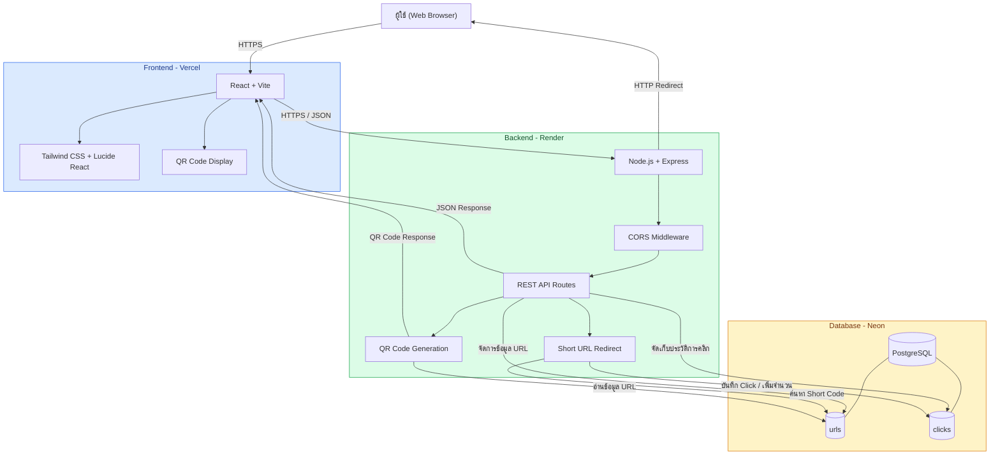
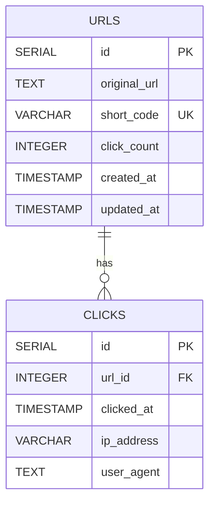
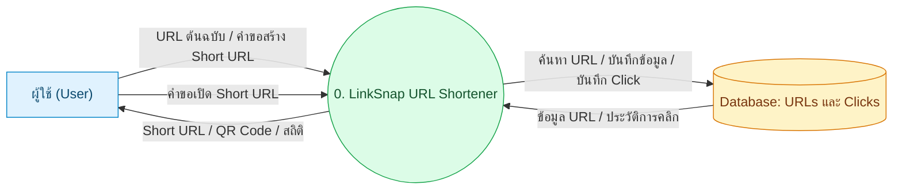

# 🔗 LinkSnap — URL Shortener

ระบบย่อลิงก์ (URL Shortener) สำหรับสร้าง Short URL จาก URL ต้นฉบับ พร้อมสร้าง QR Code สำหรับเข้าถึงลิงก์ และติดตามสถิติการคลิก โดยพัฒนาด้วย React, Node.js, Express และ PostgreSQL

<p align="center">
  <a href="https://short-url-system-nu.vercel.app/">🌐 ทดลองใช้งาน LinkSnap</a>
  &nbsp; | &nbsp;
  <a href="https://github.com/aom5947/short-url-system">💻 GitHub Repository</a>
</p>

---

## 📌 รายละเอียดโครงการ

**LinkSnap** เป็นเว็บแอปพลิเคชันสำหรับย่อ URL ที่ช่วยให้ผู้ใช้สามารถสร้างลิงก์สั้นจาก URL ต้นฉบับ นำลิงก์ไปใช้งานหรือแชร์ต่อได้สะดวก พร้อมแสดง QR Code และจัดเก็บข้อมูลการคลิกเพื่อใช้ตรวจสอบสถิติ

### ✨ ความสามารถของระบบ

* 🔗 **สร้าง Short URL:** แปลง URL ต้นฉบับให้เป็นลิงก์สั้น
* 📋 **แสดงรายการ URL:** ดูรายการลิงก์ที่สร้างไว้
* 📱 **สร้าง QR Code:** สร้าง QR Code สำหรับเข้าถึงลิงก์
* 🔀 **Redirect:** เมื่อเปิด Short URL ระบบจะเปลี่ยนเส้นทางไปยัง URL ต้นฉบับ
* 📊 **Click Tracking:** บันทึกและแสดงจำนวนการคลิก
* 🕒 **Click History:** จัดเก็บประวัติการคลิกพร้อมวันและเวลา รวมถึงข้อมูล IP Address และ User Agent ตามที่ระบบได้รับ
* 🗄️ **Database Integration:** จัดเก็บข้อมูล URL และประวัติการคลิกด้วย PostgreSQL

---

## 🌐 ทดลองใช้งานระบบ

| รายการ      | URL                                         |
| ----------- | ------------------------------------------- |
| Frontend    | https://short-url-system-nu.vercel.app/     |
| Backend API | https://short-url-system-bqjo.onrender.com/ |
| GitHub      | https://github.com/aom5947/short-url-system |


---

## 🛠️ เทคโนโลยีที่ใช้

### Frontend

* React
* Vite
* Tailwind CSS
* Lucide React
* JavaScript

### Backend

* Node.js
* Express.js
* REST API
* CORS
* dotenv
* pg (node-postgres)

### Database

* PostgreSQL
* Neon Database

### Deployment

* Vercel — Frontend
* Render — Backend
* Neon — PostgreSQL Database
* GitHub — Source Code Management

---

## 🏗️ System Architecture



### การทำงานโดยสรุป

1. ผู้ใช้เปิดเว็บไซต์ LinkSnap ผ่าน Web Browser
2. Frontend ส่งคำขอไปยัง Backend API
3. Backend ตรวจสอบข้อมูลและสร้าง Short Code
4. Backend บันทึก URL ลง PostgreSQL
5. ระบบส่ง Short URL กลับไปแสดงบนหน้าเว็บ พร้อม QR Code
6. เมื่อผู้ใช้เปิด Short URL ระบบค้นหา URL ต้นฉบับ บันทึกข้อมูลการคลิก และ Redirect ไปยังปลายทาง
7. ผู้ใช้สามารถตรวจสอบรายการ URL และสถิติการคลิกได้

---

## 🗃️ Database Design

ระบบใช้ PostgreSQL โดยมีตารางหลัก 2 ตาราง ได้แก่ `urls` และ `clicks`

### ER Diagram



### ตาราง `urls`

| Field          | Type        | Description                     |
| -------------- | ----------- | ------------------------------- |
| `id`           | SERIAL      | Primary Key                     |
| `original_url` | TEXT        | URL ต้นฉบับ                     |
| `short_code`   | VARCHAR(20) | รหัส URL ย่อ ไม่ซ้ำกัน          |
| `click_count`  | INTEGER     | จำนวนครั้งที่คลิก ค่าเริ่มต้น 0 |
| `created_at`   | TIMESTAMP   | วันที่สร้างข้อมูล               |
| `updated_at`   | TIMESTAMP   | วันที่แก้ไขข้อมูลล่าสุด         |

### ตาราง `clicks`

| Field        | Type        | Description                   |
| ------------ | ----------- | ----------------------------- |
| `id`         | SERIAL      | Primary Key                   |
| `url_id`     | INTEGER     | Foreign Key อ้างอิง `urls.id` |
| `clicked_at` | TIMESTAMP   | วันที่และเวลาที่คลิก          |
| `ip_address` | VARCHAR(45) | IP Address ของผู้คลิก         |
| `user_agent` | TEXT        | ข้อมูล Browser หรืออุปกรณ์    |

### ความสัมพันธ์

* `urls.id` เป็น Primary Key ของตาราง `urls`
* `clicks.id` เป็น Primary Key ของตาราง `clicks`
* `clicks.url_id` เป็น Foreign Key ที่อ้างอิง `urls.id`
* URL หนึ่งรายการสามารถมีประวัติการคลิกได้หลายรายการ (One-to-Many)
* เมื่อ URL ถูกลบ ประวัติการคลิกที่เกี่ยวข้องจะถูกลบตามด้วย `ON DELETE CASCADE`

### SQL สำหรับสร้างตาราง

```sql
CREATE TABLE IF NOT EXISTS urls (
    id SERIAL PRIMARY KEY,
    original_url TEXT NOT NULL,
    short_code VARCHAR(20) UNIQUE NOT NULL,
    click_count INTEGER DEFAULT 0,
    created_at TIMESTAMP DEFAULT CURRENT_TIMESTAMP,
    updated_at TIMESTAMP DEFAULT CURRENT_TIMESTAMP
);

CREATE TABLE IF NOT EXISTS clicks (
    id SERIAL PRIMARY KEY,
    url_id INTEGER NOT NULL
        REFERENCES urls(id) ON DELETE CASCADE,
    clicked_at TIMESTAMP DEFAULT CURRENT_TIMESTAMP,
    ip_address VARCHAR(45),
    user_agent TEXT
);
```

> หากมีตารางเหล่านี้อยู่แล้วใน Neon ไม่จำเป็นต้องสร้างซ้ำ

---

## 🔄 DFD Level 0



### คำอธิบาย DFD

* **External Entity:** ผู้ใช้ที่เข้ามาใช้งานระบบ
* **Process 0:** ระบบ LinkSnap สำหรับสร้างและจัดการ Short URL
* **Data Store:** ฐานข้อมูล PostgreSQL ที่เก็บข้อมูล URL และประวัติการคลิก
* **Data Flow:** ข้อมูล URL คำขอสร้างลิงก์ ข้อมูล QR Code และข้อมูลสถิติการคลิก

---

## 📂 Project Structure

```text
short-url-system/
│
├── backend/
│   ├── src/
│   │   ├── server.js
│   │   └── routes/
│   │       └── urlRoutes.js
│   ├── package.json
│   └── .env
│
├── frontend/
│   ├── src/
│   │   ├── App.jsx
│   │   ├── main.jsx
│   │   └── ...
│   ├── public/
│   ├── package.json
│   └── .env
│
├── .gitignore
└── README.md
```

> โครงสร้างนี้เป็นภาพรวมตามไฟล์หลักของโปรเจกต์ ควรตรวจสอบกับ Repository จริงและปรับรายการไฟล์ให้ตรงกับเวอร์ชันล่าสุด

---

## ⚙️ การติดตั้งและใช้งานบนเครื่อง Local

### 1. สิ่งที่ต้องเตรียม

* Node.js และ npm
* Git
* PostgreSQL หรือบัญชี Neon Database
* Code Editor เช่น Visual Studio Code

### 2. Clone Repository

```bash
git clone https://github.com/aom5947/short-url-system.git

cd short-url-system
```

### 3. ตั้งค่า Backend

```bash
cd backend
npm install
```

สร้างไฟล์ `.env` ภายในโฟลเดอร์ `backend`

```env
PORT=5000
BASE_URL=http://localhost:5000
DATABASE_URL=ใส่_NEON_CONNECTION_STRING_ที่นี่
```

**คำอธิบาย Environment Variables**

| Variable       | Description                           |
| -------------- | ------------------------------------- |
| `PORT`         | Port สำหรับ Backend ในเครื่อง Local   |
| `BASE_URL`     | Base URL ที่ใช้สร้าง Short URL        |
| `DATABASE_URL` | PostgreSQL Connection String จาก Neon |

> ห้าม Commit ไฟล์ `.env` หรือเปิดเผย Connection String และรหัสผ่านใน GitHub

### 4. เริ่มต้น Backend

```bash
node src/server.js
```

Backend จะทำงานที่:

```text
http://localhost:5000
```

### 5. ตั้งค่า Frontend

เปิด Terminal อีกหน้าต่างหนึ่ง

```bash
cd frontend
npm install
```

สร้างไฟล์ `.env` ภายในโฟลเดอร์ `frontend`

```env
VITE_API_URL=http://localhost:5000
```

### 6. เริ่มต้น Frontend

```bash
npm run dev
```

เปิดเว็บไซต์ตาม URL ที่ Vite แสดงใน Terminal โดยทั่วไปคือ:

```text
http://localhost:5173
```

---

## 🔌 API Endpoints

Backend ให้บริการ REST API สำหรับจัดการ Short URL และข้อมูลสถิติ

| Method | Endpoint              | Description                                |
| ------ | --------------------- | ------------------------------------------ |
| `GET`  | `/`                   | ตรวจสอบสถานะ Backend                       |
| `POST` | `/api/urls`           | สร้าง Short URL                            |
| `GET`  | `/api/urls`           | ดึงรายการ URL                              |
| `GET`  | `/api/urls/:id/stats` | ดูสถิติของ URL                             |
| `GET`  | `/api/urls/:id/qr`    | สร้างหรือรับ QR Code ของ URL               |
| `GET`  | `/:shortCode`         | Redirect ไปยัง URL ต้นฉบับและบันทึกการคลิก |

### 1. ตรวจสอบสถานะ Backend

**Request**

```http
GET /
```

**ตัวอย่าง Response**

```json
{
  "success": true,
  "message": "URL Shortener API is running"
}
```

### 2. สร้าง Short URL

**Request**

```http
POST /api/urls
Content-Type: application/json
```

**ตัวอย่าง Request Body**

```json
{
  "original_url": "https://www.example.com"
}
```

**ตัวอย่าง cURL**

```bash
curl -X POST http://localhost:5000/api/urls \
  -H "Content-Type: application/json" \
  -d "{\"original_url\":\"https://www.example.com\"}"
```

ระบบจะรับ URL ต้นฉบับ สร้าง Short Code และบันทึกข้อมูลลงฐานข้อมูล ก่อนส่งผลลัพธ์กลับไปยัง Frontend

### 3. ดูรายการ URL

**Request**

```http
GET /api/urls
```

ใช้สำหรับเรียกดูรายการ Short URL ที่จัดเก็บอยู่ในระบบ

### 4. ดูสถิติการคลิก

**Request**

```http
GET /api/urls/:id/stats
```

ตัวอย่าง:

```http
GET /api/urls/1/stats
```

ใช้สำหรับดูสถิติและข้อมูลการคลิกของ URL ตาม ID

### 5. สร้างหรือรับ QR Code

**Request**

```http
GET /api/urls/:id/qr
```

ตัวอย่าง:

```http
GET /api/urls/1/qr
```

ใช้สำหรับเรียก QR Code ที่เชื่อมโยงกับ URL ตาม ID

### 6. Redirect ผ่าน Short URL

**Request**

```http
GET /:shortCode
```

ตัวอย่าง:

```http
GET /abc123
```

ระบบค้นหา Short Code ในฐานข้อมูล บันทึกข้อมูลการคลิก และ Redirect ผู้ใช้ไปยัง URL ต้นฉบับ

> หมายเหตุ: ตัวอย่าง Request และ Endpoint อ้างอิงจากโครงสร้าง API ของโปรเจกต์ ควรตรวจสอบ Response จริงจาก `backend/src/routes/urlRoutes.js` ก่อนนำไปใช้อ้างอิงเป็นเอกสาร API ฉบับสมบูรณ์

---

## 🔐 Environment Variables และความปลอดภัย

ตัวแปรที่จำเป็นสำหรับการเชื่อมต่อระบบ:

**Backend `.env`**

```env
PORT=5000
BASE_URL=http://localhost:5000
DATABASE_URL=your_neon_database_connection_string
```

**Frontend `.env`**

```env
VITE_API_URL=http://localhost:5000
```

แนวทางความปลอดภัย:

* ไม่เผยแพร่รหัสผ่านฐานข้อมูลหรือ Secret Key
* ไม่ Commit ไฟล์ `.env` ลง Repository
* กำหนด CORS ให้ยอมรับเฉพาะ Origin ที่ต้องการ
* ใช้ HTTPS สำหรับระบบที่ Deploy บน Production
* เก็บข้อมูล IP Address และ User Agent เท่าที่จำเป็น และจัดการข้อมูลตามความเหมาะสมด้านความเป็นส่วนตัว

---

## 🚀 Deployment

### Frontend — Vercel

เว็บไซต์ Frontend ถูก Deploy บน Vercel

URL:

```text
https://short-url-system-nu.vercel.app/
```

Environment Variable ที่ใช้:

```env
VITE_API_URL=https://short-url-system-bqjo.onrender.com
```

หลังเปลี่ยน Environment Variable ให้ Build และ Deploy Frontend ใหม่ เพื่อให้เว็บไซต์ใช้ Backend URL ที่ถูกต้อง

### Backend — Render

Backend ถูก Deploy บน Render

URL:

```text
https://short-url-system-bqjo.onrender.com/
```

คำสั่งเริ่มต้น Backend:

```bash
node src/server.js
```

Environment Variables ที่ต้องตั้งค่าบน Render:

```env
DATABASE_URL=your_neon_database_connection_string
BASE_URL=https://short-url-system-bqjo.onrender.com
NODE_ENV=production
```

ไม่จำเป็นต้องกำหนด `PORT` เองบน Render ในกรณีที่แอปอ่านค่าจาก `process.env.PORT` เพราะ Render จะกำหนด Port ให้กับ Web Service

### Database — Neon

ระบบใช้ Neon สำหรับ PostgreSQL Database โดย Backend เชื่อมต่อผ่าน `DATABASE_URL`

ตรวจสอบให้แน่ใจว่า:

1. ใช้ Connection String จาก Neon Project และ Branch ที่ถูกต้อง
2. ตั้งค่า `DATABASE_URL` บน Render
3. มีตาราง `urls` และ `clicks` อยู่ในฐานข้อมูล
4. Backend สามารถเชื่อมต่อฐานข้อมูลได้ก่อนทดสอบ API

---

## 🧪 วิธีทดสอบระบบ

1. เปิดเว็บไซต์ LinkSnap
2. กรอก URL ต้นฉบับที่ต้องการย่อ
3. กดปุ่มสร้าง Short URL
4. ตรวจสอบว่าระบบแสดง Short URL ที่สร้างขึ้น
5. ตรวจสอบ QR Code และทดลองสแกนด้วยโทรศัพท์
6. เปิด Short URL เพื่อทดสอบ Redirect ไปยัง URL ต้นฉบับ
7. ตรวจสอบว่าจำนวนคลิกเพิ่มขึ้น
8. ตรวจสอบประวัติการคลิกและข้อมูลในฐานข้อมูล

### Checklist การทดสอบ

* [ ] เปิดหน้าเว็บไซต์ได้
* [ ] Frontend เชื่อมต่อ Backend ได้
* [ ] สร้าง Short URL ได้
* [ ] ข้อมูลถูกบันทึกลง PostgreSQL
* [ ] แสดงรายการ URL ได้
* [ ] สร้างและแสดง QR Code ได้
* [ ] สแกน QR Code แล้วเข้าถึง URL ได้
* [ ] Short URL Redirect ไปยัง URL ต้นฉบับได้
* [ ] จำนวนคลิกได้รับการอัปเดต
* [ ] ดูสถิติการคลิกได้
* [ ] Backend ทำงานบน Render
* [ ] Frontend ทำงานบน Vercel

---

## 📋 ข้อจำกัดและข้อควรทราบ

* การใช้งานระบบออนไลน์ขึ้นอยู่กับสถานะของ Frontend, Backend และ Database
* การเรียก API ที่ต้องใช้ฐานข้อมูลจะไม่สำเร็จหาก Backend ไม่สามารถเชื่อมต่อ PostgreSQL ได้
* URL ที่นำมาทดสอบควรเป็น URL ที่เข้าถึงได้จริง
* ควรตรวจสอบการตั้งค่า CORS, Environment Variables และ Database Connection ก่อนนำระบบไปใช้งานจริง

---

## 👨‍💻 ผู้พัฒนา

**ชื่อโครงการ:** LinkSnap — URL Shortener

**GitHub:** [aom5947](https://github.com/aom5947)

**Repository:** [short-url-system](https://github.com/aom5947/short-url-system)

**Live Demo:** [LinkSnap](https://short-url-system-nu.vercel.app/)

---

## 📄 License

โปรเจกต์นี้จัดทำขึ้นเพื่อการศึกษาและการทดสอบความสามารถด้านการออกแบบและพัฒนาเว็บแอปพลิเคชัน
